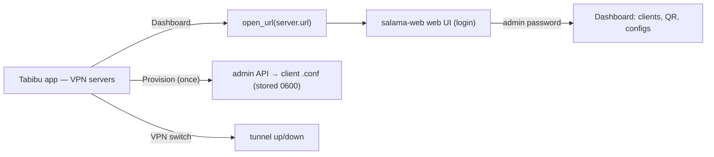
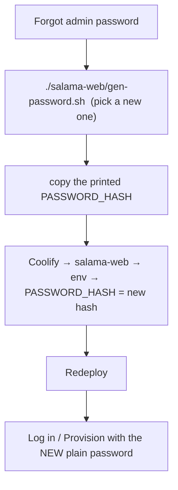

# Accounts & sign-in (self-host model)

> **Decision (2026-08-18): self-host, lightweight login.** No central Tabibu
> account service. Each person deploys their own `salama-web`; the "account" is
> that deployment's admin, and the "dashboard" is the server's own web UI.

## What this means in practice

`salama-web` (wg-easy) is **single-admin**: one admin credential per server,
set at deploy time as `PASSWORD_HASH`. So in the self-host model:

| The app asked for… | Self-host reality |
|---|---|
| "Create an account" | The admin credential is set **once at deploy** (you choose the password → `PASSWORD_HASH` in Coolify). There is no multi-user sign-up on a single-admin server. |
| "…taken to the web… a simple dashboard of VPN features" | The **server's own web UI** is that dashboard (clients, QR codes, config downloads). The app's **Dashboard** button opens it; you log in with the admin password. |
| "Get an email and verify" | Not applicable to a single-admin self-hosted server — email-verified multi-user sign-up only exists in a hosted service (see "If you outgrow this"). |
| "Forgot / reset password" | Regenerate the hash and redeploy (below). |

## Built in the app (self-host)

- **Dashboard** button on each VPN server (Network → Salama VPN) → opens that
  server's web UI (`open_url(server.url)`), where you sign in with the admin
  password. This is the "taken to the web dashboard" step.
- **Provision** (already built) uses the same admin password once to pull a
  client config; it's never stored.

## The full flow (create account + password → pull config)

In the self-host model your "account" is the server's single admin, and its
password is set at deploy — so "create an account and a password" happens once,
when you stand the server up:

1. **Create the password:** `./salama-web/gen-password.sh` → choose your admin
   password. It prints `PASSWORD_HASH=…`. (This password *is* your account.)
2. **Deploy with it:** paste the **raw** hash into Coolify's `PASSWORD_HASH` env
   var (raw = single `$`; the compose passes a real env var through verbatim —
   see `salama-web/README.md`), set `WG_HOST`, and deploy.
3. **Pull the config in the app:** Network → Salama VPN → **+ Add server** (the
   deployed URL) → **Provision** → enter the **plain** password from step 1.
   Tabibu logs in, creates a `tabibu` client, and downloads its config (stored
   `0600`, never uploaded).
4. **Toggle the VPN on.**

## Troubleshooting — "Provision failed"

The app now says which of these it is:

- **"Login rejected (401)…"** — the password is wrong, **or** the server's
  `PASSWORD_HASH` is corrupted. The most common cause: an older setup put the
  hash in a `.env` file **without doubling the `$`**, so `docker compose`
  interpolation mangled it (e.g. `$2a$12$abc…` → `$2a$12`). **Fix:** regenerate
  and redeploy — `./salama-web/gen-password.sh` (paste raw into Coolify), or for
  a local `.env` use `gen-password.sh --env` (which doubles the `$` for you).
- **"Can't reach …"** — wrong URL, server not deployed, or the web route/DNS/
  firewall isn't up. Confirm the server's web UI opens in a browser (the
  **Dashboard** button), and that it's `https`.

## Reset the admin password (self-host)

There's no self-service reset on a single-admin server — you re-set the
credential and redeploy:

The app can link to this: a **"Reset admin password"** entry that opens these
instructions (or the Coolify env page). Small; add on request.

## Security (applies if you add a login layer)

If you later put a real login in front of your own deployment, keep:
argon2id password hashing; single-use, short-TTL, hashed verify/reset tokens;
constant response on reset-request (don't reveal if an email exists);
httpOnly+secure sessions, invalidated on password change; rate-limited
login/reset. Email (verification/reset) needs an SMTP/transactional provider,
which you'd self-host or configure.

## If you outgrow self-host → hosted (future, not built)

Multi-user sign-up with email verification and a managed dashboard is a
**hosted control plane**: a Rust/axum API + Postgres + a transactional email
provider that provisions a per-user WireGuard peer across a server fleet. That
is the deferred *control-plane / PoP-fleet / legal* gate in `notes.md`. Revisit
this doc's security section and pick that path if/when you want a public service.
