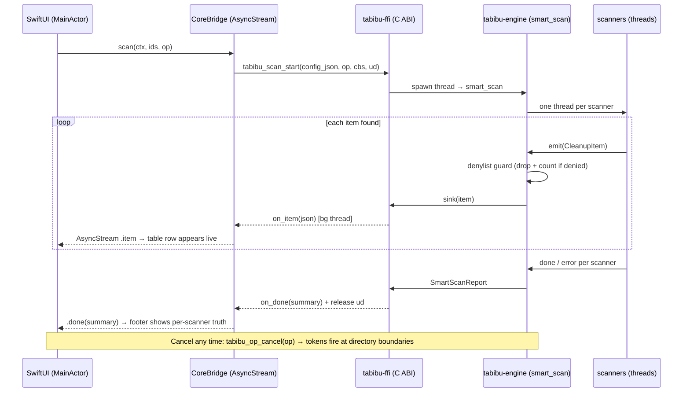
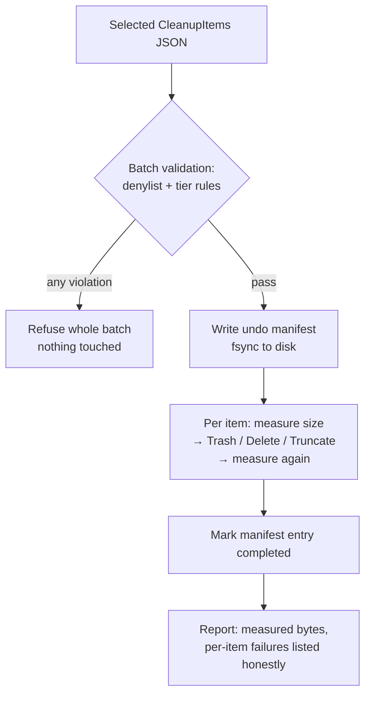

# Tabibu FFI Contract

> **SUPERSEDED (ADR-0003).** The C-FFI bridge existed only for the Swift shell,
> which has been replaced by a Tauri shell that calls the Rust core directly
> (serde over Tauri commands — no C ABI). `tabibu-ffi` and this contract are
> removed from the build; this file is retained for history.

Audience: anyone touching `core/crates/tabibu-ffi` or
`Tabibu/Sources/Tabibu/Core/CoreBridge.swift`. Decision record: ADR-0001.
Header of record: `core/include/tabibu_core.h` (copied into the Swift C
target by `scripts/build-core.sh`).

## Rules (non-negotiable)

1. **Rust allocates, Rust frees.** Every `char*` returned crosses back
   through `tabibu_string_free`. Incoming strings are borrowed per-call.
2. **JSON payloads**, UTF-8, shapes defined by the serde derives in Rust and
   mirrored by `Codable` in `CoreBridge.swift`. Those two files are the
   schema; don't introduce a third place.
3. **Version lockstep.** `FFI_VERSION` (Rust) == `expectedFFIVersion`
   (Swift) == `TABIBU_FFI_VERSION_EXPECTED` (header). Bump on any breaking
   change; Swift `precondition`s at launch.
4. **Callbacks** run on a Rust background thread; payload pointers are valid
   only during the call — copy immediately. `user_data` must outlive the
   operation (Swift: `Unmanaged.passRetained`, released in the done callback).
5. Any change to this surface requires a note in
   `memory/handover_session.md` (both sides break).

## Surface (v1)

| Function | Kind | Payload |
|---|---|---|
| `tabibu_ffi_version` | sync | — |
| `tabibu_op_new/cancel/free` | sync | cancellation handles |
| `tabibu_scan_start` | **async**, streams | config in; `CleanupItem` per item; summary at done |
| `tabibu_reclaim` | sync (call off-main) | `CleanupItem[]` + ctx in; report out |
| `tabibu_size_tree` | sync, cancellable | `DirNode` out |
| `tabibu_dupes_find` | sync, streams groups | `DuplicateGroup[]` out |
| `tabibu_find_remnants` | sync | `CleanupItem[]` out |
| `tabibu_monitor_sample` | sync | `SystemSample` out |
| `tabibu_string_free` | sync | releases Rust strings |

## Scan data flow

## Reclaim flow (the only mutating path)

## Testing

`core/crates/tabibu-ffi/tests/roundtrip.rs` is the contract test — it calls
the ABI exactly the way Swift does. If you change the surface, change that
test in the same commit, plus the header, plus `CoreBridge.swift`, plus the
version constants.
