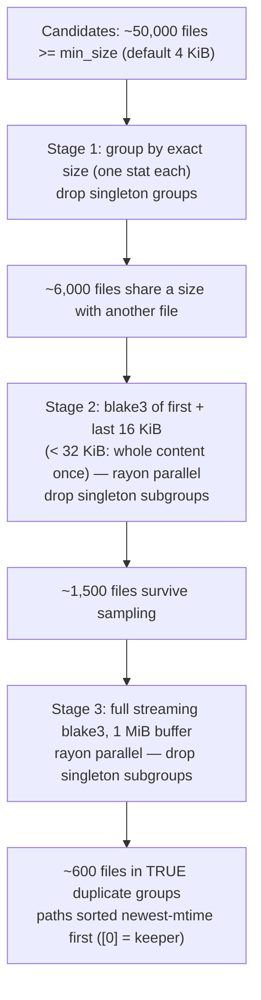

# tabibu-dupes — duplicate-file funnel

Finds true (byte-identical) duplicate sets via a three-stage funnel that runs
the cheapest filter first and only pays for full hashing on files that are
still plausibly duplicates. Confirmed groups stream to the UI via `on_group`
as they are finalised and are also returned as a sorted list.

## The funnel

## Why head + tail sampling

Most same-size non-duplicates (logs, exports, media, VM images) diverge near
the start or end: headers, timestamps, trailing indexes. Reading 32 KiB
instead of whole files turns stage 2 into two seeks + two small reads per
file, eliminating almost all false candidates before the expensive stage 3.
Sampling can collide (files differing only in the middle), which is exactly
what stage 3 exists to catch — correctness never depends on the sample.

## Complexity

- Stage 1: `O(n)` stats, zero file reads.
- Stage 2: `O(s)` where `s` = files sharing a size; <= 32 KiB read each.
- Stage 3: `O(total bytes of survivors)` — the only full-content pass.
- Hash subgrouping is hash-map based; final sort is `O(g log g)` on groups.

## Safety & robustness

- Files that vanish or error mid-hash are dropped silently; one bad file
  never fails the run.
- `to_cleanup_items` spares the newest copy and emits the rest as
  `Category::Duplicate` at `SafetyTier::Review` — never auto-selected,
  never hard-deleted; reason text names the kept copy.
- Cancellation is checked between stages and inside every rayon loop.

## Benchmark

`benches/dupes.rs` (criterion, `harness = false`): 2,000 x 8 KiB files with
~30% duplicates (300 pairs), fixture built once in setup; benches
`find_duplicates` end-to-end. Target: well under 100 ms warm on Apple
silicon. Run with `cargo bench -p tabibu-dupes`.
