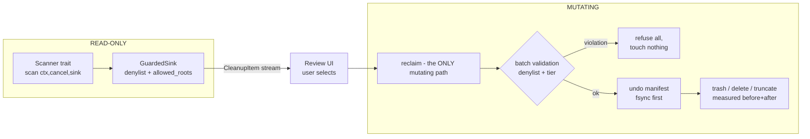

# Module: tabibu-engine

The safety core: shared types, the scanning/reclaiming contract, denylist,
undo manifests, cancellation, and Smart Scan orchestration. Everything else
plugs into this. (Guide §4; ADR-0001 for how it crosses to Swift.)

## The contract

- **Scanners are read-only**; every scanner runs behind `run_scanner`, whose
  `GuardedSink` drops (and counts) any item violating `denylist::permitted`.
  A buggy or malicious scanner cannot leak a protected path — property-tested
  with an adversarial scanner in `tests/denylist_prop.rs`.
- **Tiers:** `Safe` (pre-selected, may `Delete`), `Review` (never
  pre-selected, Trash only), `Risky` (never pre-selected, Trash only).
  Tier rules are enforced in `reclaim`, not trusted to the UI.
- **Undo manifest** (`undo.rs`): JSON written + fsynced *before* the first
  mutation; entries marked completed as work proceeds, so a crash leaves a
  truthful record. Tmp-file + rename for atomic rewrite.
- **Honest sizing:** reclaimed bytes are measured per item (size before −
  size after), never estimated.
- **`smart_scan`** (`orchestrate.rs`): one thread per scanner, shared guarded
  sink, per-scanner outcomes (`items`, `guard_rejected`, `error`) reported
  even when siblings fail.

## Denylist (the invariant)

Absolute prefixes (`/System`, `/bin`, `/usr` except `/usr/local`, …) plus
home-relative user data (`Documents`, `Desktop`, `Library/Mail`, iCloud
Drive, Keychains, device backups…). Relative paths and any `..` component
are rejected outright. `home` is injected — fully testable.

## Tests (15)

7 unit (denylist, cancel, undo) + 3 adversarial property tests + 5
golden-image/fault-injection reclaim tests (exact-files-changed snapshot
diff, batch refusal, tier violation, permission-denied honesty).

## Extension points

New scanner: implement `Scanner`, register in your crate's `scanners()`,
wire the id through `tabibu-ffi`'s scan registry. Mutating behavior beyond
trash/delete/truncate requires a new `ReclaimAction` + engine tests first.
