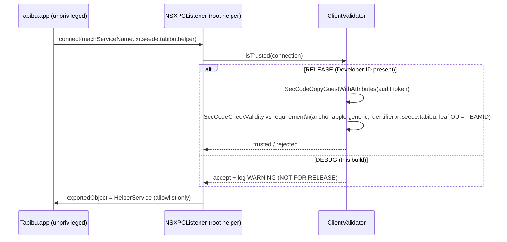

# Module: TabibuHelper (privileged XPC helper)

A tiny root daemon for the few operations the unprivileged GUI genuinely
cannot do itself. Build-verifiable here; **installable only from a signed,
notarized app** via `SMAppService` — externally blocked on this machine (no
Developer ID), documented in `docs/release.md`.

## Allowlisted command surface (no "run path as root")

The entire privileged API is the fixed `TabibuHelperProtocol`
(`HelperProtocol.swift`). Adding a capability means adding a typed method,
reviewed deliberately — there is no generic "execute" path.

| Method | Purpose | Status |
|---|---|---|
| `checkOpenFiles(paths:)` | Which paths are held open (guard before touching `/private/var/folders`) | via `/usr/sbin/lsof` with explicit paths |
| `smartStatus()` | Disk SMART health | honest stub: `smartctl` not bundled yet |
| `version()` | App↔helper handshake | implemented |

`lsof` is used over the libproc route (`proc_listpids` + `proc_pidfdinfo`)
deliberately: for a correctness-critical guard check, robustness across OS
versions beats the faster-but-fragile syscall path.

## Security: client validation

The production audit-token validation is implemented (`#if !DEBUG`) but gated:
with no signing identity on the build machine, debug builds accept connections
with a loud warning log. The `<TEAMID>` placeholder in the requirement string
is filled at release time. **The DEBUG fallback must never ship.**

## Install (when Developer ID arrives)

The signed app registers the helper with `SMAppService.daemon(plistName:)`
using `xr.seede.tabibu.helper.plist` (MachServices + `AssociatedBundleIdentifiers`).
The helper binary lives at `Contents/MacOS/TabibuHelper` inside the app bundle.
Until then this component is build-verified only (`swift build` is green).
