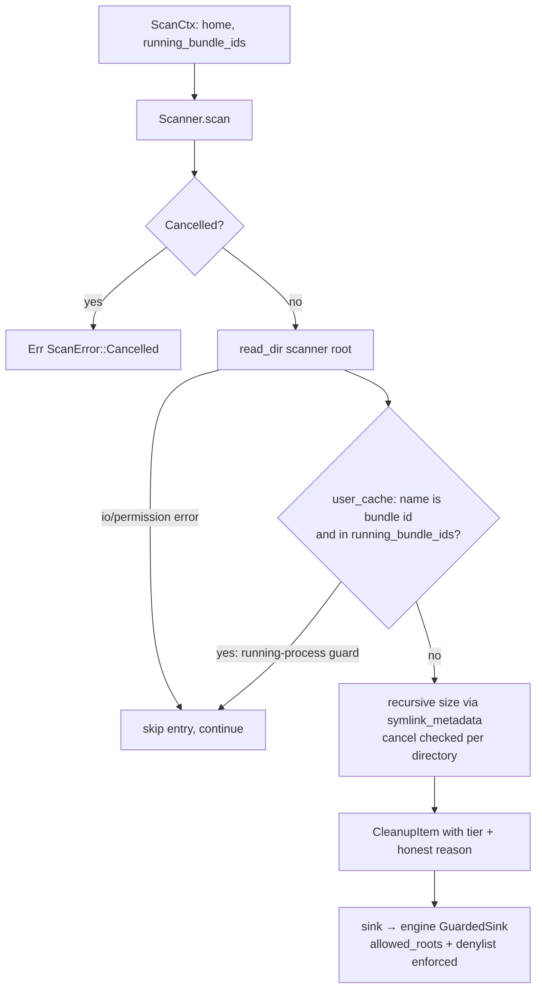

# tabibu-junk — junk scanners

Read-only detectors of reclaimable disk space. All roots derive from the injected
`ScanCtx::home` (never env vars), sizes are measured recursively via `symlink_metadata`
without following symlinks, permission errors skip the entry instead of failing, and
cancellation is checked at every directory boundary. Registry: `tabibu_junk::scanners()`.

## Scanners

| id | Roots scanned | Tier | Rationale |
|---|---|---|---|
| `trash` | `~/.Trash` (one item per top-level entry) | Safe | User already discarded these; emptying only finalizes intent. |
| `user_cache` | `~/Library/Caches/*` (one item per subdirectory) | Safe (bundle-id names, incl. well-known browsers) / Review (unrecognized names) | Caches are regenerated by apps; running apps are skipped entirely so live caches are never pulled out from under a process. |
| `dev_cache` | `~/Library/Developer/Xcode/DerivedData`, `~/Library/Developer/CoreSimulator/Caches`, `~/.npm/_cacache`, `~/Library/Caches/Yarn`, `~/Library/Caches/pip`, `~/.cargo/registry/cache`, `~/Library/Caches/Homebrew` | Review (DerivedData, Simulator, cargo) / Safe (npm, Yarn, pip, Homebrew) | Tool caches re-download or rebuild on demand; build/registry caches get Review because regeneration can be slow or need network. |
| `temp` | `~/Library/Caches/TemporaryItems` (files, mtime > 7 d) and `std::env::temp_dir()` top-level entries — only if it canonicalizes into `/var/folders` | Review | Age alone is a heuristic; open-file checks land later, so a human reviews first. |
| `log` | `~/Library/Logs` — files older than 30 d, one grouped item per immediate subdirectory (loose stale files reported individually) | Safe | Old logs are diagnostic history, not app state; default action stays Trash so they remain recoverable. |

## Scan flow

## False-positive risks

- `user_cache`: a folder merely *named* like a bundle id is trusted as one; helper
  processes that share a cache but run under a different bundle id evade the running
  guard. Mitigated by reclaim-by-Trash, not delete.
- `user_cache` Review items: non-bundle-id folders (e.g. shared SDK caches) may belong
  to several apps — hence Review, never auto-selected.
- `temp`/`log`: mtime staleness misfires for files an app holds open but rarely writes
  (open-file detection is a planned follow-up); a restored-from-backup tree can look
  uniformly stale.
- `log`: the grouped item points at the whole per-app subdirectory while only stale
  bytes are counted, so reclaiming removes fresh logs in that folder too.
- `dev_cache`: `DerivedData` and the cargo registry cache are correctness-safe but can
  cost long rebuilds/re-downloads — tiered Review deliberately.
