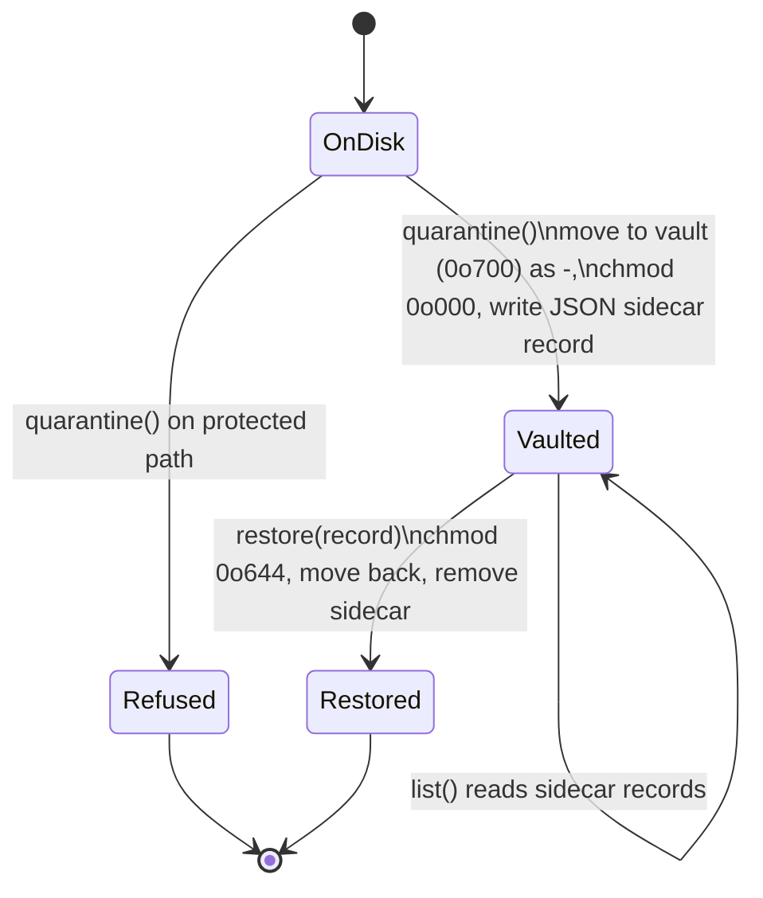

# tabibu-malware — adware heuristics + quarantine vault

On-demand, read-only heuristic detection of macOS adware *persistence* (never binaries,
never system files). Every detection is tier **Risky** — never auto-selected; the user
decides. Registry: `tabibu_malware::scanners()`. Quarantine is a reversible move into a
locked vault — nothing is ever deleted. A false positive that bricks a Mac ends the
product, so every heuristic below errs toward silence.

## Detection patterns

| Scanner / pattern | What is flagged | Rationale | False-positive guard |
|---|---|---|---|
| `adware_heuristics` (a) temp/hidden program | `~/Library/LaunchAgents/*.plist` whose program (launchd `Program`, else `ProgramArguments[0]`) lives in `/tmp`, `/var/tmp`, `/private/tmp`, or a dot-folder under home | Legitimate apps start from `/Applications` or `~/Library`; adware hides in wipe-on-reboot or invisible locations | Flagged item is the plist only; normal app paths never match |
| (b) shell download/eval | `/bin/sh`/`bash`/`zsh` with a `-c` argument containing `curl` or `eval` | Download-and-execute at login is the classic adware loader | Plain `-c` scripts (no curl/eval) pass; tested with an `echo` agent |
| (c) random label | `com.<token>` where `looks_random(token)`: ASCII alphanumeric, ≥ 8 chars, and vowel/letter ratio < 0.15 (`y` counts as a vowel) **or** ≥ 4 digit↔letter switches | Adware generates labels (`com.pcv.hlpramc`-style) to evade recognition | Unit-tested both ways: `docker`, `keystone`, `microsoft`, `googleupdater`, `mysqlworkbench` never match |
| (d) orphaned autostart | `RunAtLoad=true` and the program file no longer exists | Leftover persistence from removed (often unwanted) software | Existing binaries — wherever installed — never match |
| `rogue_profiles` | `/Library/Managed Preferences/<user>/{com.google.Chrome, org.mozilla.firefox, com.microsoft.Edge}.plist` exists | Managed browser policies on a non-MDM personal Mac are a classic browser-hijack vector (`profiles` needs root, so existence is the honest user-level check) | Reason explicitly tells the user to verify whether the Mac *should* be MDM-managed; detection is existence-only, file is never parsed or touched |

Unparseable plists are skipped, not flagged — corruption is not evidence of malice.
Multiple patterns on one plist yield one item (first match, order a→d).

## Quarantine vault lifecycle

`Vault::new(dir, home)` refuses (`VaultError::Refused`) anything under `/System`, `/usr`
(entire tree, stricter than the engine denylist), `/bin`, `/sbin`, `/Library/Apple`, plus
everything `tabibu_engine::denylist::denied` protects (user data, traversal, relative paths).

Moves use `fs::rename`, falling back to copy+remove on cross-device errors (the fallback
is untestable in a single-tempdir test and is verified by review). Vaulted files are
`0o000` inside a `0o700` directory: unreadable, unexecutable, fully recoverable.

## ClamAV feature flag — honest status

`--features clamav` exposes only a stub (`clamav::engine_available() == false`). Real
signature scanning needs bundled `libclamav` (GPL-2.0 — a license boundary requiring a
deliberate distribution decision) plus a multi-hundred-MB signature DB with an update
pipeline. Deferred to M7 (`memory/todo.md`); we report "unavailable" rather than fake it.

## What we deliberately do NOT do

- No real-time monitoring: Endpoint Security framework needs an Apple-granted
  entitlement; scans are on-demand only.
- No quarantining of binaries or anything system-owned — only persistence artifacts.
- No deletion ever: quarantine is a reversible move; `restore` is always possible.
- No root-only `profiles` invocation pretending to be a full MDM audit.
