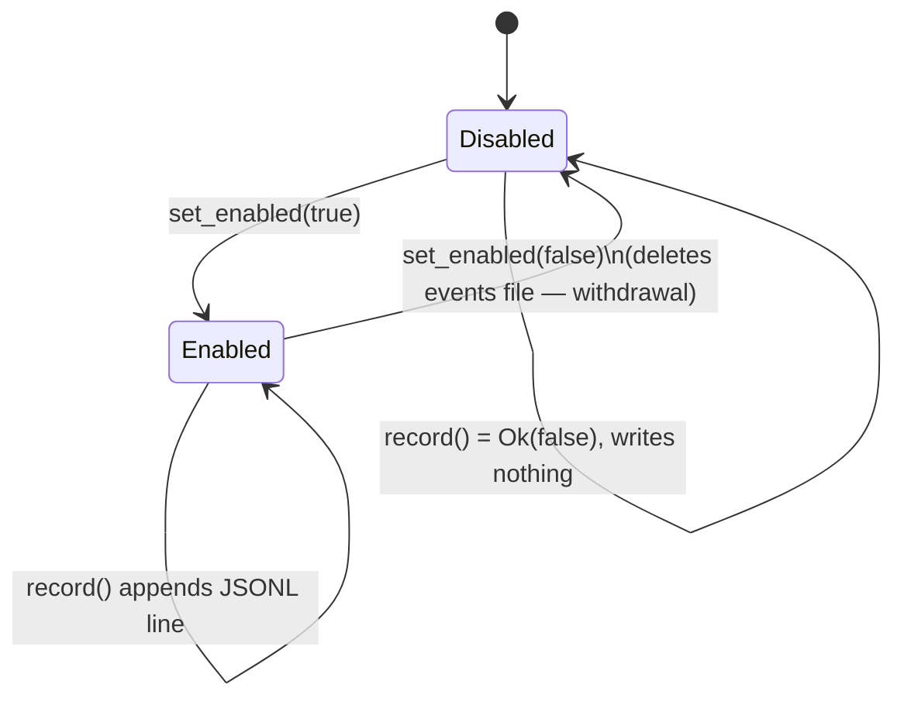

# Module: tabibu-telemetry (deselection signal)

Opt-in, privacy-respecting telemetry crate. It records exactly one thing: a
**false-positive signal**. When a user *unchecks* a `Safe`-tier cleanup item
during review — Tabibu suggested removing it and the user disagreed — we learn
*which category* of suggestion users distrust, so we can improve defaults.
Built on Tabibu's honesty principle (opt-in, no content, no PII).

## Privacy contract (this is the design, not a feature)

What we record — and **nothing else**:

| Field | Example | Why it's safe |
|---|---|---|
| `category` | `"user_cache"` | scanner id, not a path |
| `tier` | `"Safe"` | fixed enum of suggestion tiers |
| `size_bucket` | `"100mb_1gb"` | coarse order-of-magnitude, never exact bytes |
| `ts_unix` | `1700000000` | caller-supplied; the lib never reads the clock |

We **never** record a path, filename, file contents, bundle id, exact byte
count, or any user-identifying data. `DeselectionEvent` structurally has no
field for such data. The crate has **no network dependency** — data is written
local-only as append-only JSONL in a caller-provided directory.

## Consent lifecycle

Default OFF. `record()` while disabled is a silent no-op (`Ok(false)`), and no
events file is ever created. Disabling is treated as **withdrawal**: the
existing events file is deleted.



## Data shape

`<dir>/telemetry-consent.json` → `{"enabled":true}` (atomic tmp+rename).
`<dir>/deselections.jsonl` → one JSON object per line:

```json
{"category":"user_cache","tier":"Safe","size_bucket":"100mb_1gb","ts_unix":1700000000}
```

`export()` reads these back for a future "see what's collected" transparency
UI; `clear()` deletes the events file without touching consent. Corrupt or
missing consent fails safe to disabled.
