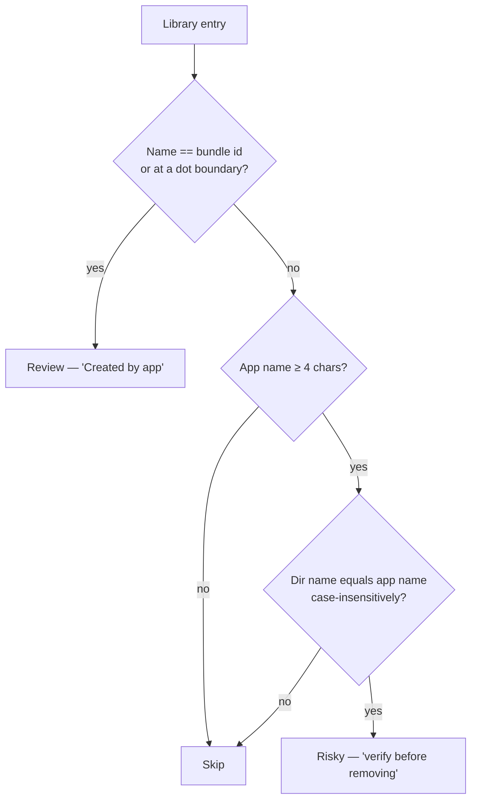

# tabibu-uninstall

Read-only detectors for the uninstaller domain: app remnants, orphaned support
data, unused apps, and stale binaries. Conservative by contract — a false
positive here destroys unrelated user data, so uncertainty raises the tier or
drops the item.

## Remnant search locations (`find_remnants`)

| Location (under `~/Library/`)          | Match rule                          | Tier   |
|----------------------------------------|-------------------------------------|--------|
| `Application Support/<entry>`          | exact bundle id / fuzzy app name    | Review / Risky |
| `Caches/<entry>`                       | exact bundle id / fuzzy app name    | Review / Risky |
| `Logs/<entry>`                         | exact bundle id / fuzzy app name    | Review / Risky |
| `Preferences/<bundle_id>*.plist`       | id prefix anchored at `.` boundary  | Review |
| `LaunchAgents/<bundle_id>*.plist`      | id prefix anchored at `.` boundary  | Review |
| `Containers/<bundle_id>`               | exact path                          | Review |
| `Group Containers/*<bundle_id>*`       | id at `.` boundaries (team-id form) | Review |
| `Saved Application State/<id>.savedState` | exact path                       | Review |
| `WebKit/<bundle_id>`                   | exact path                          | Review |
| `HTTPStorages/<bundle_id>`             | exact path                          | Review |

Other scanners: `orphan` (bundle-id-named dirs in Application Support / Caches /
Containers with no installed app, Risky), `unused_app` (no open in >180 days per
Spotlight, Risky), `stale_binary` (broken symlinks in `/usr/local/bin` and
`/opt/homebrew/bin`, Review).

## Remnant matching decision

## False-positive mitigations

- Exact bundle-id evidence is still only `Review`; fuzzy name matches are
  `Risky` and never auto-selected.
- Fuzzy matching refused for app names under 4 characters, and only applies
  to directories.
- Plist prefix matches must hit a `.` boundary (`com.foo.app` never claims
  `com.foo.apple.plist`); empty / dot-less bundle ids match nothing.
- Orphans require strict reverse-DNS shape (≥3 segments, known first token),
  and skip installed apps, running apps, and all `com.apple.*`.
- Unused apps: dates come from Spotlight only — no date, no verdict; Apple
  apps, running apps, and Tabibu itself are never emitted.
- Stale binaries: only symlinks whose target is confirmed `NotFound`;
  permission errors are treated as "unknown" and skipped.
- Sizes use `symlink_metadata` recursively; links are never followed.
