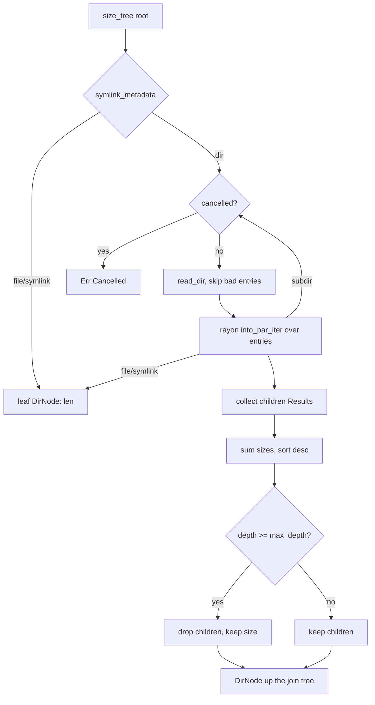

# tabibu-walk — parallel traversal & size tree

## Purpose

Fast, cancellable filesystem traversal for every Tabibu scanner that needs
sizes or file streams: the space map (`size_tree`), dedupe / old-files
(`walk_files`), and quick totals (`dir_size`). Symlinks are inspected with
`symlink_metadata` and **never** followed, so cycles cannot loop and a link
counts only as the link object itself.

## API

| Item | Signature | Notes |
| --- | --- | --- |
| `DirNode` | `{ path, size_bytes, is_dir, children }` | serde `Serialize`; children sorted by size desc |
| `size_tree` | `(root, &CancelToken, max_depth: Option<usize>) -> Result<DirNode, WalkError>` | root = depth 0; nodes beyond `max_depth` are pruned but still aggregate into ancestors |
| `walk_files` | `(root, &CancelToken, &(dyn Fn(&Path, &Metadata) + Sync)) -> Result<(), WalkError>` | callback fires for every regular file, concurrently |
| `dir_size` | `(root, &CancelToken) -> Result<u64, WalkError>` | `size_tree(root, _, Some(0)).size_bytes` |
| `WalkError` | `Cancelled` \| `Root { path, source }` | entry-level IO/permission errors are skipped, never fatal; only an unreadable root errors |

## Concurrency model

Recursive divide-and-conquer on rayon's work-stealing pool. Each directory
is read sequentially (one `read_dir` per directory), then its entries are
mapped with `into_par_iter()`; subdirectory recursion is stolen by idle
workers. No shared mutable state — each subtree returns its `DirNode`
(or unit, for `walk_files`) up the join tree. The `CancelToken` (an
`Arc<AtomicBool>`) is checked at every directory boundary; a cancelled
walk short-circuits via `Result` collection / `try_for_each`.

## Benchmarks

`benches/walk.rs` (criterion, `harness = false`) builds a ~5,000-file
tempdir fixture once and benches `size_tree` with unlimited depth and with
`max_depth = 1`. Run: `cargo bench -p tabibu-walk`.
