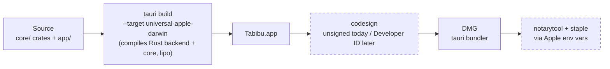

# Tabibu release pipeline

How a commit becomes a downloadable DMG, what is automated today, and what is
externally blocked.

> **Updated for the Tauri shell (ADR-0003).** Packaging is now done by
> `tauri build`, not the hand-rolled `build-core.sh`/`make-app.sh`/`make-dmg.sh`
> (removed). Those scripts and the DMG-compression measurements below are
> historical — Tauri produces its own `.app` and DMG. The signing /
> notarization *external blockers* still apply.

## Pipeline



Dashed boxes are **externally blocked** (no Developer ID / notarization
credentials). `tauri build` activates them automatically when the Apple
secrets are present (see `.github/workflows/release.yml`). CI
(`ci.yml`) only `cargo build`s `app/src-tauri` to keep the runner light.

## Scripts (remaining)

| Script | Purpose |
|---|---|
| `scripts/make-icon.sh` | Generate `build/AppIcon.icns` + iconset (copy into `app/src-tauri/icons/`) |
| `scripts/bench-gate.sh` | Criterion regression gate (>5% mean) on a *consistent* machine; `--update-baseline` to bless, `--smoke` for CI (run-only, no cross-machine compare) |
| `scripts/uninstall-tabibu.sh` | User-facing uninstaller; dry-run by default, `--yes` to delete |

## DMG compression choice

`make-dmg.sh` probes `hdiutil create -help` at runtime and picks the first
supported format in this order: **ULMO -> ULFO -> UDZO**. Measured on this
builder (macOS 26.5, Apple Silicon) against a 19.4 MiB stub `Tabibu.app`
(two 9.6 MB universal binaries whose 5 MB payloads are ~50% repetitive text /
~50% random bytes, approximating real binary entropy; the Swift app is not
built yet):

| Format | Codec | DMG size | Ratio vs 19.4 MiB app | Create time | Min macOS to mount |
|---|---|---|---|---|---|
| ULMO | LZMA  | 10,101,677 B (9.63 MiB) | 2.02x | 5.0 s | 10.15 Catalina |
| ULFO | lzfse | 10,204,846 B (9.73 MiB) | 1.99x | 5.1 s | 10.11 El Capitan |
| UDZO | zlib  | 10,177,062 B (9.71 MiB) | 1.99x | 5.1 s | effectively all |

Honest caveats about these numbers: half the stub payload is random bytes, so
the codecs converge near the incompressible floor and the spread is only ~1%.
On real Swift/Rust release binaries (highly structured Mach-O), LZMA's lead is
typically 10-25% over zlib. ULMO is the right default because the app already
requires macOS 13.0 (`LSMinimumSystemVersion`), far above ULMO's 10.15 mount
floor, and download size is what matters for distribution; create-time
differences are noise at this size. Re-measure with the real app before 1.0
and update this table.

## Benchmark gate

`scripts/bench-gate.sh` runs `cargo bench -p tabibu-walk --bench walk` and
`-p tabibu-dupes --bench dupes` with `--save-baseline current`, then parses
`core/target/criterion/<benchmark>/current/estimates.json`
(`.mean.point_estimate`, nanoseconds — layout verified against criterion 0.5
output on this repo) and fails if any mean exceeds the blessed value in
`core/benches-baseline/<benchmark>/estimates.json` by more than 5%.

**Runner awareness (important).** Criterion baselines are *hardware-specific*:
a baseline blessed on an Apple-Silicon laptop is meaningless on a shared
GitHub macos-14 runner and would report large bogus regressions. So:

- The **regression gate** (plain `bench-gate.sh`) is for a *consistent* machine
  — a developer's box or a dedicated self-hosted runner — where the baseline
  was produced. `core/benches-baseline/` is **gitignored**, never committed.
- **CI** runs `bench-gate.sh --smoke`: reduced criterion sampling
  (`--sample-size 10 --warm-up-time 1 --measurement-time 2`), no baseline
  comparison. It only proves the benches still compile and run, and keeps the
  runner's CPU/memory/time use low.

Reference numbers blessed on the dev machine (2026-06-13), for orientation
only (not a CI gate):

| Benchmark | Mean |
|---|---|
| `find_duplicates_2k_files_30pct_dupes` | ~21 ms |
| `size_tree_5k_files` | ~4.8 ms |
| `size_tree_5k_files_depth1` | ~5.0 ms |

## Static checks

- `core/rustfmt.toml`: stable options only; `use_small_heuristics = "Max"`
  was evaluated and rejected because it would reformat ~10 existing files.
- `core/deny.toml`: license allow-list (MIT/Apache-2.0/BSD/ISC/Unicode-3.0/
  Zlib/CC0/Unlicense/MIT-0/MPL-2.0), vulnerability denial, duplicate-version
  warnings. cargo-deny is **not installed locally**; CI enforces it via
  `EmbarkStudios/cargo-deny-action@v2`. The future `clamav` feature of
  `tabibu-malware` is GPL-2.0-adjacent and must stay behind an off-by-default
  feature (see comments in deny.toml).

## External blockers

| Blocker | Effect today | Owner/next step |
|---|---|---|
| **No Developer ID certificate** (`security find-identity -v -p codesigning` -> 0 identities) | All builds are ad-hoc signed (`SIGN_IDENTITY=-`); Gatekeeper (`spctl -a`) rejects the app, users must right-click > Open | Apple Developer Program enrollment; then export the cert and set `DEVELOPER_ID_CERT`, `DEVELOPER_ID_CERT_PW`, `DEVELOPER_ID_IDENTITY` repo secrets |
| **No notarytool credentials** | `make-dmg.sh NOTARIZE=1` prints exactly which step is skipped and why; DMG ships un-notarized | Requires the same enrollment; then `xcrun notarytool store-credentials tabibu-notary` locally and `APPLE_ID`/`APPLE_TEAM_ID`/`APPLE_APP_PASSWORD` secrets in CI |
| **Sparkle EdDSA keys not generated** | No auto-update channel; pipeline ends at the DMG | After 0.1 ships: `generate_keys` from the Sparkle distribution, keep the private key in a secret, embed the public key in Info.plist (`SUPublicEDKey`), publish an appcast |

## Exact commands once credentials arrive

```sh
# 1. One-time: store notarization credentials in the login keychain
xcrun notarytool store-credentials tabibu-notary \
  --apple-id alex@bsa.ai --team-id <TEAMID>

# 2. Signed, hardened-runtime build
SIGN_IDENTITY="Developer ID Application: <Name> (<TEAMID>)" scripts/make-app.sh

# 3. DMG + notarization + stapling (make-dmg.sh finds the keychain profile)
NOTARIZE=1 scripts/make-dmg.sh

# 4. Confirm Gatekeeper acceptance
spctl -a -t open --context context:primary-signature -v build/Tabibu-*.dmg
spctl -a -t exec -vv build/Tabibu.app   # "accepted ... Notarized Developer ID"
```

In CI, adding the six secrets listed above activates the conditional signing
and notarization steps in `.github/workflows/release.yml` with no further
changes.

## Local quickstart

```sh
scripts/build-core.sh                                            # Rust core
swift build -c release --arch arm64 --arch x86_64 --package-path Tabibu
swift build -c release --arch arm64 --arch x86_64 --package-path TabibuMonitor
scripts/make-app.sh                                              # ad-hoc signed app
scripts/make-dmg.sh                                              # build/Tabibu-0.1.0.dmg
```

`make-app.sh` looks for binaries in `build/<Name>` first, then
`<Name>/.build/apple/Products/Release/<Name>` (universal builds), then
`<Name>/.build/release/<Name>` (single-arch), and prints exactly what is
missing if the Swift packages have not been built.
