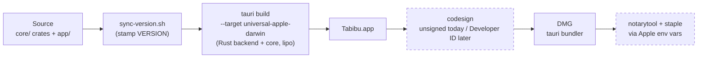

# Tabibu release pipeline

How a commit becomes a downloadable DMG, what is automated today, and what is
externally blocked.

> Packaging is done by `tauri build` (ADR-0003) — there is no hand-rolled
> bundler. The version is single-sourced from the root **`VERSION`** file.

## Versioning — one source of truth

The root **`VERSION`** file is authoritative. `scripts/sync-version.sh` stamps
it into every manifest (`core/Cargo.toml`, `app/src-tauri/Cargo.toml`,
`tauri.conf.json`, `app/package.json`) and the docs version chip, so cargo,
tauri, npm, and the docs site all report the same version.

```sh
# bump the version, then propagate it everywhere:
echo 0.1.5 > VERSION
./scripts/sync-version.sh

./scripts/sync-version.sh --check   # CI gate: fails if any manifest drifted
```

CI (`ci.yml`) runs `--check` so a drifted manifest fails the build; the release
workflow runs the sync before building, so the bundle always matches `VERSION`.

## Pipeline



Dashed boxes are **externally blocked** (no Developer ID / notarization
credentials). `tauri build` activates them automatically when the Apple secrets
are present (see `.github/workflows/release.yml`). On a `v*` tag the release
workflow (macos-14) builds the universal bundle and uploads the DMG from
`app/src-tauri/target/universal-apple-darwin/release/bundle/dmg/`.

## Build locally

`scripts/build-app.sh` is the one entry point — it stamps the version from
`VERSION`, adds the universal targets, installs the Tauri CLI, and bundles. The
release workflow runs the same script, so local and CI builds are identical.

```sh
./scripts/build-app.sh            # universal .app + DMG (the distributable)
./scripts/build-app.sh --native   # release, host arch only (faster)
./scripts/build-app.sh --debug    # quick unoptimized build for testing
# → app/src-tauri/target/universal-apple-darwin/release/bundle/dmg/Tabibu_<VERSION>_universal.dmg

# regenerate the icon set from a 1024²+ PNG:
cd app && npx tauri icon /path/to/tabibu-app-icon.png   # writes app/src-tauri/icons/
```

## Scripts

| Script | Purpose |
|---|---|
| `scripts/build-app.sh` | Build the app (`--debug`/`--native`/universal); stamps `VERSION` first — used locally and by `release.yml` |
| `scripts/sync-version.sh` | Propagate the root `VERSION` into every manifest + docs chip (`--check` to verify) |
| `scripts/bench-gate.sh` | Criterion regression gate (>5% mean) on a *consistent* machine; `--update-baseline` to bless, `--smoke` for CI |
| `scripts/uninstall-tabibu.sh` | User-facing uninstaller; dry-run by default, `--yes` to delete |

## Continuous integration (all macos-14)

| Workflow | Jobs |
|---|---|
| `ci.yml` | version (VERSION in sync), rustfmt, clippy (`-D warnings`), `cargo test --workspace`, cargo-deny, bench-smoke, app compile |
| `release.yml` | on `v*` tag: run `build-app.sh` (sync version → universal build) → conditional sign/notarize → upload DMG |
| `docs.yml` | render Markdown → designed HTML (`docs/build.mjs`) and deploy GitHub Pages |

cargo-deny runs from a prebuilt binary via `taiki-e/install-action` (the
container-based `cargo-deny-action` is Linux-only, so it can't run on macOS).

## Benchmark gate

`scripts/bench-gate.sh` runs `cargo bench -p tabibu-walk --bench walk` and
`-p tabibu-dupes --bench dupes` with `--save-baseline current`, parses
`core/target/criterion/<benchmark>/current/estimates.json`
(`.mean.point_estimate`, ns), and fails if any mean exceeds the blessed value in
`core/benches-baseline/<benchmark>/estimates.json` by more than 5%.

**Runner awareness.** Criterion baselines are *hardware-specific*: a baseline
blessed on an Apple-Silicon laptop is meaningless on a shared GitHub runner and
would report bogus regressions. So the regression gate (plain `bench-gate.sh`)
is for a *consistent* machine and `core/benches-baseline/` is **gitignored**;
CI runs `bench-gate.sh --smoke` (reduced sampling, no comparison — proves the
benches still compile and run).

## Static checks

- `core/rustfmt.toml`: stable options only.
- `core/deny.toml`: license allow-list, vulnerability denial, duplicate-version
  warnings. The future `clamav` feature of `tabibu-malware` is GPL-2.0-adjacent
  and must stay behind an off-by-default feature (see comments in deny.toml).

## External blockers

| Blocker | Effect today | Next step |
|---|---|---|
| **No Developer ID certificate** | Bundles are unsigned; Gatekeeper rejects the app, users must right-click → Open | Apple Developer Program enrollment, then add the repo secrets below |
| **No notarytool credentials** | DMG ships un-notarized | Same enrollment; `xcrun notarytool store-credentials` + the Apple secrets |
| **Sparkle keys not generated** | No auto-update channel; pipeline ends at the DMG | After 0.1 ships: `generate_keys`, embed `SUPublicEDKey`, publish an appcast |

Signing is **not wired** today — `release.yml` builds an unsigned bundle and
sets no Apple env (so the bundler never attempts, or fails on, code signing).
To enable it once an Apple Developer account exists, add an `env:` block to the
build step in `release.yml` with these repo secrets (Tauri reads them natively):

```yaml
      - name: Build universal app + DMG (version from VERSION)
        env:
          APPLE_CERTIFICATE: ${{ secrets.APPLE_CERTIFICATE }}            # base64 .p12
          APPLE_CERTIFICATE_PASSWORD: ${{ secrets.APPLE_CERTIFICATE_PASSWORD }}
          APPLE_SIGNING_IDENTITY: ${{ secrets.APPLE_SIGNING_IDENTITY }}  # "Developer ID Application: … (TEAMID)"
          APPLE_ID: ${{ secrets.APPLE_ID }}                              # notarization
          APPLE_PASSWORD: ${{ secrets.APPLE_APP_PASSWORD }}
          APPLE_TEAM_ID: ${{ secrets.APPLE_TEAM_ID }}
        run: ./scripts/build-app.sh
```
