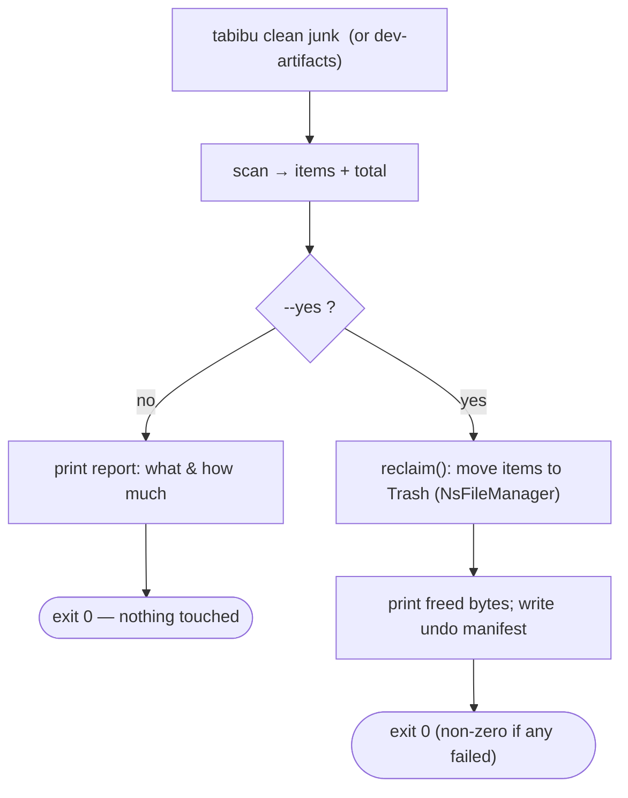
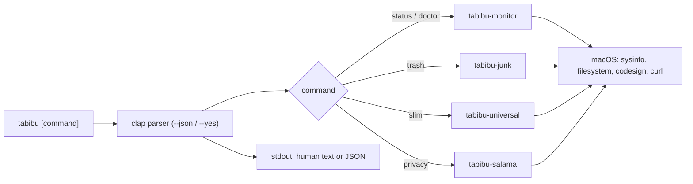
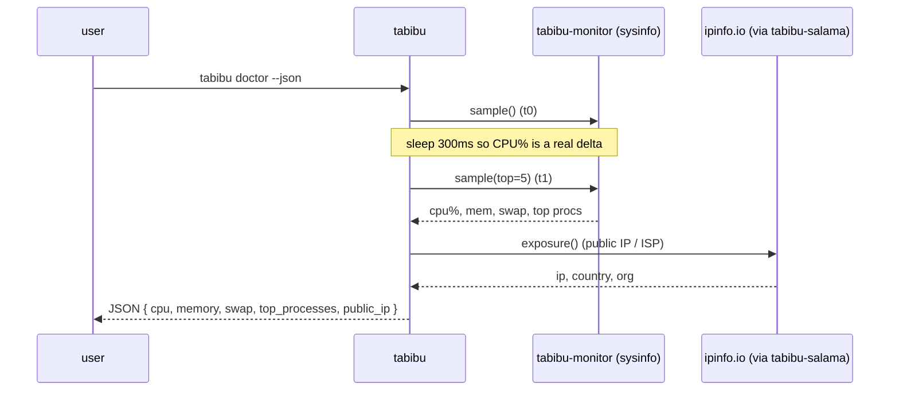

# `tabibu` — the command-line companion

`tabibu` is the terminal front-end to the same Rust core that powers the Tabibu
desktop app (`core/crates/tabibu-cli`, binary name `tabibu`). Anything you do in
the UI you can script in a shell, a CI job, or a cron task.

*Tabibu* means **doctor** in Swahili, so the command vocabulary is a checkup
metaphor: you run `doctor`, read your Mac's `status`, and treat what's wrong.

---

## Design principles

| Principle | Why |
|---|---|
| **`--json` on every command** | Machine-readable output for scripts/CI. Human text by default. |
| **Dry-run by default; `--yes` to execute** | Destructive verbs (`trash empty`, `slim <app>`) preview first and change nothing until you pass `--yes`. Safe to run in automation. |
| **Non-interactive** | No TUI to get stuck in — one command in, one result out. Composes with pipes, `jq`, cron. |
| **Same core as the app** | The CLI calls the exact crates the app does, so behavior (and safety guards) are identical. |
| **Honest exit codes** | `0` success, non-zero when an action had errors or a check failed — usable in `&&` chains. |
| **Global flags** | `--json`, `--quiet`, `--no-color` work on every command, before or after the subcommand. |

---

## Global flags & exit codes

Three flags apply to every command and may appear before or after the
subcommand (`tabibu --quiet clean junk --yes` ≡ `tabibu clean junk --yes --quiet`):

| Flag | Effect |
|---|---|
| `--json` | Emit machine-readable JSON instead of human text. |
| `--quiet` | Suppress human progress/hint/confirmation lines on **stdout**. Errors (stderr) and `--json` output are unaffected — ideal in cron. |
| `--no-color` | Accepted for script/CI compatibility. Output is already plain (Tabibu never emits color), so this is a documented no-op; `NO_COLOR` needs nothing special for the same reason. |

Exit codes (stable, usable in `&&` chains and CI):

| Code | Meaning |
|---|---|
| `0` | Success — including a dry-run that printed a report and touched nothing. |
| `1` | The command ran but reported a failure: an I/O error, a delegated tool failed, a target wasn't found, or a check was negative (e.g. `protect remove` of an absent path). |
| `2` | Usage error from the parser: unknown command/flag, bad argument, or an unknown shell for `completions`. |

## Config file (optional)

`~/.config/tabibu/config.toml` (same directory as `protected.list`) can set
default values for a couple of flags so you don't retype them. It is **entirely
optional** — with no file, the CLI behaves exactly as before.

```toml
# ~/.config/tabibu/config.toml
depth = 2          # default for `space --depth`
min_size = 1048576 # default for `scan dupes --min-size` (bytes)
```

Precedence, per key: **explicit flag > config file > built-in default**
(`depth` 1, `min_size` 4096). Unknown keys and unparseable values are ignored —
a bad config never breaks a command. It's a small TOML subset (flat
`key = value` lines; `#` comments and `[section]` headers are accepted and
ignored), so no TOML dependency is pulled in for two integers. **Protected paths
are not configured here** — manage them with `tabibu protect` (they live in
`protected.list`, the single source of truth).

## Scheduling (optional, opt-in)

Because every `clean` removal is a **Trash move** (reversible — restore from
Trash), a weekly cleanup is safe to automate. Tabibu does **not** install any
timer for you; a sample LaunchAgent lives at
[`scripts/xr.seede.tabibu.maintenance.plist`](../scripts/xr.seede.tabibu.maintenance.plist)
and you opt in by loading it yourself.

**launchd** (runs as you — no `sudo`, no root):

```bash
# 1. Edit the sample: set the binary path (`which tabibu`) and your username
#    (launchd does NOT expand ~), then copy it in:
cp scripts/xr.seede.tabibu.maintenance.plist ~/Library/LaunchAgents/

# 2. Load it (modern macOS):
launchctl bootstrap gui/$(id -u) ~/Library/LaunchAgents/xr.seede.tabibu.maintenance.plist
#    (older syntax: launchctl load ~/Library/LaunchAgents/xr.seede.tabibu.maintenance.plist)

# Check / run now / remove:
launchctl print gui/$(id -u)/xr.seede.tabibu.maintenance
launchctl kickstart -k gui/$(id -u)/xr.seede.tabibu.maintenance   # run immediately
launchctl bootout   gui/$(id -u)/xr.seede.tabibu.maintenance      # stop & remove
```

The sample runs `tabibu clean caches --yes` on Sundays at 03:00 and logs to
`~/Library/Logs/tabibu-maintenance.log`. Swap in any other reversible target
(`clean junk --yes`, `clean all --yes`).

**cron** alternative (`crontab -e`):

```cron
# Weekly cache cleanup (reversible → Trash)
0 3 * * 0 /usr/local/bin/tabibu clean caches --yes >> ~/Library/Logs/tabibu-maintenance.log 2>&1

# Hourly health snapshot for a CI/monitoring log (read-only)
55 * * * * /usr/local/bin/tabibu report --json >> ~/Library/Logs/tabibu-health.jsonl
```

Only automate `--yes` on the reversible cleanups (they go to the Trash).
Delegated prunes (`brew clean`, `docker prune`) are *not* Trash moves, so
schedule those only if you accept the tool's own removal.

## Install / build

**Everything, one shot** — builds the desktop app (+ its bundled helpers) *and*
the CLI, then installs the app to `/Applications`, `tabibu` to `/usr/local/bin`,
and the man page. `sudo` is used only where a target isn't writable as you:

```bash
./scripts/install.sh              # universal app + host-arch CLI, then install
./scripts/install.sh --native     # app for this Mac's arch only (faster)
./scripts/install.sh --debug      # quick unoptimized build of both
./scripts/install.sh --no-install # build everything, install nothing
```

**Just the CLI:**

```bash
cd core
cargo build --release -p tabibu-cli      # binary at core/target/release/tabibu
cp target/release/tabibu /usr/local/bin/ # optional: put it on PATH
```

## Man page

A `tabibu.1` man page is generated from the clap definition at build time (via
`build.rs` + `clap_mangen`), so it can never drift from `--help`. `cargo build`
writes the canonical page to the crate's `OUT_DIR`; a committed copy for viewing
lives at `core/crates/tabibu-cli/man/tabibu.1`.

```bash
man core/crates/tabibu-cli/man/tabibu.1   # read it
./scripts/gen-man.sh                       # refresh the committed copy after CLI changes
sudo cp core/crates/tabibu-cli/man/tabibu.1 /usr/local/share/man/man1/  # install (then `man tabibu`)
```

## Shell completions

`tabibu completions <shell>` prints a completion script (generated from the same
clap definition, so it never drifts from `--help`). Supported shells include
bash, zsh, and fish. Install by sourcing the script from your shell:

```bash
# zsh — put it on your fpath
tabibu completions zsh > ~/.zfunc/_tabibu   # ensure ~/.zfunc is in $fpath, then `compinit`

# bash
tabibu completions bash > /usr/local/etc/bash_completion.d/tabibu

# fish
tabibu completions fish > ~/.config/fish/completions/tabibu.fish
```

---

## Commands (implemented)

```
tabibu status                 Quick vitals: CPU %, memory, public IP
tabibu doctor                 Full checkup: vitals + swap + top processes
tabibu trash status           How much is in the Trash
tabibu trash empty [--yes]    Empty the Trash (dry run without --yes)
tabibu slim                   List universal apps with reclaimable weight
tabibu slim <APP.app> --yes   Thin one app to this Mac's architecture
tabibu privacy                What the network sees (IP/ISP) + DNS encryption
tabibu report                 One snapshot: health + disk space + privacy (CI/cron)
tabibu space <PATH> [--depth N]  Disk-usage tree, largest entries first
tabibu scan large             Large, old files in Downloads (review only)
tabibu scan dupes <PATH> [--min-size N]  Byte-identical duplicates (keep newest)
tabibu scan junk              Reclaimable junk by category (report only)
tabibu scan malware           Adware / rogue-profile heuristics (report only)
tabibu scan dev-artifacts [PATH] [--global]   Rebuildable build dirs (report only)
tabibu flush-dns              Flush the macOS DNS resolver cache (admin)
tabibu clean junk [--yes]     Move junk to the Trash — reports first, --yes acts
tabibu clean caches [--yes]   App + developer caches only
tabibu clean logs [--yes]     Log files only
tabibu clean all [--yes]      All junk + rebuildable dev artifacts across home
tabibu clean dev-artifacts [PATH] [--global] [--yes]   Trash rebuildable build dirs
tabibu brew status           Homebrew readout: version, packages, reclaimable cache, orphans
tabibu brew clean [--yes]    Clear old versions + stale cache (runs `brew cleanup`)
tabibu brew autoremove [--yes]   Remove orphaned dependencies (runs `brew autoremove`)
tabibu docker status         Docker readout: daemon state, reclaimable per category
tabibu docker prune [--yes]  Prune build cache + unused images (runs `docker` prune)
tabibu uninstall <APP> [--yes]   Remove an app + its leftovers → Trash (reversible)
tabibu protect list          Show protected paths (never reclaimed by anything)
tabibu protect add <PATH>    Protect a path (shared with the desktop app)
tabibu protect remove <PATH> Stop protecting a path
tabibu completions <SHELL>   Print a shell completion script (bash|zsh|fish|…)
```

Examples:

```bash
tabibu status                                  # human
tabibu status --json | jq .memory.used_percent # scriptable
tabibu trash empty --yes                        # actually empty
tabibu slim --json | jq '.apps[] | select(.category=="safe")'
tabibu report --json | jq '{cpu: .health.cpu_percent, free: .disk.available_bytes}'  # CI/cron snapshot
```

## Commands (roadmap — grounded on existing core crates)

Each maps to a crate that already exists and is tested; wiring is incremental.

| Command | Wraps | Notes |
|---|---|---|
| `tabibu vpn [status\|connect\|disconnect]` | app VPN engine (`tabibu-wg`) | **App-only** — needs a root helper + admin prompt the app owns. |

---

## Dev artifacts (`scan`/`clean dev-artifacts`)

Finds **rebuildable** build/dependency directories across stacks and reports
them largest-first, so you can reclaim space that regenerates from source. Scope
is **directory-level** (a `PATH`, default: current dir) or **global** (`--global`
= your whole home).

Recognized across stacks (`tabibu-devscan`): Rust `target/`, Node
`node_modules/` + `.next`/`.nuxt`/`.svelte-kit`/`.turbo`/`.parcel-cache`, generic
`dist`/`build`, Python `__pycache__`/`.venv`/`.pytest_cache`/`.mypy_cache`/`.ruff_cache`,
Gradle `.gradle`, Flutter `.dart_tool`, CocoaPods `Pods/`, Xcode `DerivedData`,
Terraform `.terraform`.

**Safety:** a directory is only flagged when it's unambiguous (e.g.
`node_modules`, `.venv`) OR its parent holds a matching project manifest (e.g.
`target/` only next to `Cargo.toml`, `build/` next to `package.json`/`build.gradle`/…).
So a hand-authored folder named `build` or `dist` is never flagged. A `venv`
must actually contain `pyvenv.cfg` to count. Recognized dirs are counted as a
unit (not descended into). Each result carries a `rebuild:` hint (e.g. `cargo
build`, `npm install`).

A whole-home scan (`--global`, or the app's Build-artifacts view) **excludes
tool/OS-managed trees** so it never offers to trash something an app depends on:
your `~/Library`, every top-level `~/.dotdir` (`~/.vscode`, `~/.npm`, `~/.nvm`,
`~/.gradle`, …), and everything the engine denylist protects (`~/Documents`,
`~/Desktop`, Photos, …) — the last of which `clean` would refuse anyway, so
scanning them would only mislead. Your projects' *own* deeper dot-dirs (a repo's
`.venv`/`.next`) are still found; an explicit `scan dev-artifacts ~/.somedir`
still descends the directory you name.

## Delegated tools (`brew`, `docker`)

These wrap package/build managers, so cleanup is **delegated to the tool itself**
rather than moved to the Trash — the same exception the app's Developer view makes.
Read verbs are always safe; destructive verbs report first and need `--yes`.

- **`brew status`** (read-only) — version, prefix, package count, reclaimable
  cache, orphaned dependencies. **`brew clean` / `brew autoremove`** run
  `brew cleanup` / `brew autoremove` (Homebrew decides what leaves its cache/orphans).
- **`docker status`** (read-only) — daemon state + reclaimable space per category
  (images / containers / volumes / build cache). **`docker prune`** runs
  `docker builder prune` + `docker image prune -a` — only **build cache + unused
  images**, both of which regenerate (rebuild / re-pull). Volumes and containers
  are left untouched (volumes may hold persistent data), so nothing irreversible
  to your data is removed.

## Protected paths (`protect`)

A **single safety list shared with the desktop app**: anything overlapping a
protected path is never trashed or deleted — by `clean`, `uninstall`, or the app
— no matter which front-end asked.

```bash
tabibu protect add ~/Projects/keep     # protect a folder (or file)
tabibu protect list                    # see what's protected
tabibu protect remove ~/Projects/keep  # stop protecting it
```

The list lives at `~/.config/tabibu/protected.list` (one path per line; `#`
comments allowed). It's enforced in `tabibu-engine::reclaim` — the product's one
mutating path — so it's a genuine safety boundary, not a display filter. Overlap
is refused in **both directions**: protecting `~/Projects/keep` also stops a
cleanup from trashing an ancestor like `~/Projects` that would take `keep` with
it. Matching is component-wise, so `~/Projects/keepsake` is unaffected.

## Uninstall (`uninstall <app>`)

Removes an app **and its leftover support files** — the caches, preferences,
containers, saved state and group containers it scattered across `~/Library`.
Give a `.app` path (`tabibu uninstall "/Applications/Foo.app"`) or just a name
(`tabibu uninstall Foo`, matched against `/Applications` and `~/Applications`).

It reports the bundle plus every remnant first (largest-first, each tagged by
how confidently it was matched); pass `--yes` to move them **all to the Trash**
— reversible, restore from Trash. Remnant matching (`tabibu-uninstall`) is
deliberately conservative: exact bundle-id matches are `Review`, fuzzy
name-only matches are `Risky` and only for names ≥ 4 characters, so unrelated
user data is never swept up. If the app's bundle id can't be read, only the
`.app` bundle is reported (no remnant scan).

## Clean — report first, then you decide

`clean` never removes anything on its own: it prints a report and only acts when
you pass `--yes`, and every removal is a **Trash move** (reversible — restore
from Trash), never a permanent delete.



## How it fits together (architecture)



The CLI is a thin presentation layer: parse → call a core crate → format. The
**same crates back the desktop app**, so there is one implementation of every
behavior and its safety checks.

## Process flow — a destructive command is dry-run first

```mermaid
flowchart TD
  A[tabibu trash empty] --> B{--yes given?}
  B -->|no| C[measure Trash size]
  C --> D[[print: would free N; re-run with --yes]]
  D --> Z([exit 0, nothing deleted])
  B -->|yes| E[empty_trash_dirs&#40;&#41;]
  E --> F[[print: freed N, M items]]
  F --> G{errors?}
  G -->|no| Z2([exit 0])
  G -->|yes| H([exit 1, errors on stderr])
```



## Data flow — `status` / `doctor`



---

## JSON output & app parity

The CLI and the desktop app are two front-ends over the **same core crates**, and
those crates own every serialized type (they `#[derive(Serialize)]`). So wherever
the CLI prints a core struct, `tabibu <cmd> --json` is the **same shape the app's
Tauri command returns** for that data — one serialization source, no parallel
schema to drift.

**Parity by shared type** — these `--json` payloads *are* the core struct:

| CLI | Shared type (crate) | App command returning the same type |
|---|---|---|
| `scan large` / `scan junk` / `scan malware`; `clean …`'s `items[]` | `Vec<CleanupItem>` (`tabibu-engine`) | `scan_malware`, `scan_orphans`, `find_remnants`, `scan_dev_artifacts` |
| `slim` | `UniversalReport` (`tabibu-universal`) | `scan_universal` |
| `space` | `DirNode` (`tabibu-walk`) | (walk) |
| `scan dupes` | `Vec<DuplicateGroup>` (`tabibu-dupes`) | (dupes) |
| `scan dev-artifacts` | `Vec<DevArtifact>` (`tabibu-devscan`) | *(app converts to `CleanupItem` for its reclaim view — see below)* |
| `privacy`; `report`'s `privacy` node | `PrivacyStatus { exposure, dns }` (`tabibu-salama`) | `salama_status` |
| `brew status` / `docker status` | `Report` (`tabibu-brew` / `tabibu-docker`) | `brew_analyze` / `docker_analyze` |
| `brew clean`/`autoremove`, `docker prune` result | `ActionOutcome` `{ok, freed_bytes, message}` | `brew_cleanup`, `docker_prune_*` |

**CLI-only envelope keys** — hand-built wrappers around (or instead of) a core
struct, for the terminal's convenience; the app has no equivalent field:

- Dry-run wrappers: `dry_run`, `would_free_bytes`, `item_count`, `items` (`clean …` without `--yes`), and `orphans`/`count` (`brew autoremove` preview).
- Small status envelopes: `trash_bytes`, `flushed`, `installed`/`running` (tool absent / daemon off), and `protect`'s `{protected}` / `{path, added|removed}`.
- **`status` / `doctor` / `report` health block** uses reader-friendly keys (`memory.used_bytes`, `memory.used_percent`, `swap.*`) rather than the raw `SystemSample` field names (`used_memory_bytes`, …). This is a deliberate presentation envelope, **not** the raw sample the app's health command returns.
- **`clean` / reclaim results** print the `ReclaimReport` **summary** (`reclaimed_bytes`, `succeeded`, `failed`); the app returns the full `ReclaimReport` (also `outcomes[]` per item and `manifest_path`). Same names, CLI shows the subset.

So: consume the struct-backed payloads above for cross-tool scripting (they match
the app), and treat the envelope keys as CLI ergonomics. `--json` never colors,
never prompts, and is unaffected by `--quiet`.

## Developer guide

**Location:** `core/crates/tabibu-cli/src/main.rs`. It depends only on core
crates + `clap` + `serde_json`; no app/Tauri code.

**Adding a command** (the pattern every command follows):

1. Add a variant to the `Command` enum (clap `#[derive(Subcommand)]`) with a
   one-line doc comment — that becomes the `--help` text.
2. Route it in `main()` to a `cmd_*` function.
3. In the `cmd_*` function: call the relevant core crate, then branch on `json`
   — `print_json(&serde_json::json!({...}))` or human `println!`. Return an
   `i32` exit code.
4. For a destructive command, gate execution behind a `--yes` flag and print a
   dry-run summary otherwise.
5. Add a test: `Cli::try_parse_from([...])` asserts parsing; keep pure helpers
   (like `human_bytes`) unit-tested. `Cli::command().debug_assert()` lints the
   whole definition.

**Testing:** `cargo test -p tabibu-cli`. The heavy logic (scanning, trashing,
thinning) is already unit/integration-tested inside its crate, so the CLI's own
tests cover argument parsing, dry-run gating, and output formatting.

**Conventions:** decimal byte units for storage (`human_bytes`, matches Finder);
never invent a code path the app doesn't have — if a behavior needs new logic,
add it to the core crate (so the app gets it too), not to the CLI.
